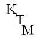
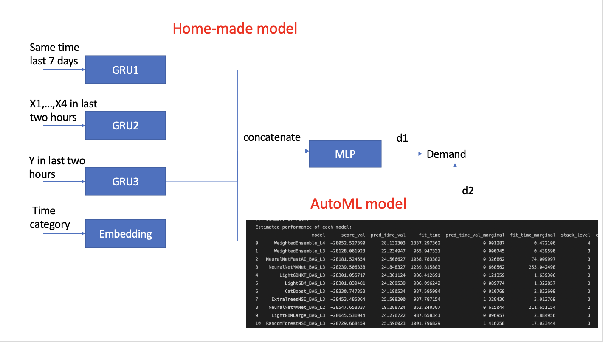

# CityHack22 Project Submission
## Project: KTM's Inspiration

< Replace the logo above with Your Project Logo >
## Team: Kowloon Tong MMW
## Members
- XU Rui (Leader)
- HUANG Jianming
- HUANG Xiuqi
- ZHANG Zhiyuan

## Description of the Project (300 words)

+ **ipynb files are in the "ipynb IS HERE!!!!!" folder**
+ **Predicted Y Values file is in the home folder**

## 3 Most Impactful Features of the Project (with Screenshot and Short Description (150 words))
1. For creators, particularly like journalist, Vlogger, commentator they need to keep up with the trend closely, but they need time to complete their works. So tight schedule it is. For example, it takes time for vlogger to write the scripts, direct the scenes and edit video, so if we can predict hot topics for them in advance, it saves time for them to create their work.

2. Another issue is that they may face the drained creativity. What we are going to do is to make a ‘inspiration pool’ for them. We use our prediction model to conclude several hot topics in the future. Also, we can also predict the expected performance results, like views for customer’s selected topic.

3. Because this ‘inspiration pool’ is make by predicted hot topics, so our customers (eg. Vlogger), they are very likely to be an internet sensation.

## Tech used (as many as required)
1. Feature Engineering

   Each sample of train data provide only 5 values[time, x1, x2, x3, x4], this do not consider the time-series information. To solve this problem, we create the feature by ourselves. The first feature is the same time last 7 days. (for exmaple, the time is 01-30 11:10, then the feature are 01-23 11:10,  01-24 11:10, ... ,01-29 11:10). The second feature is the time catogory. (00:00 as 0, 00:10 as 1, ... , 23:50 as 143). The third feature is the X1 to X4 in last two hours and the fourth feature is the demand in last two hours.

2. Preprocessing

   As the predicted value is demand, we use the log scale as we care about the percentage of difference. We also normalize the first, third, fourth feature using this formula (x-mean)/(max-min) and convert time catogory to one-hot vector.

3. Training

   We use cosineAnnealing as scheduler, adam as optimizor, early stop, drop-out and weight decay to avoid overfitting. We split the training dataset to train/test/val for our evaluation and training for 35 epoches.

4. Ensembling

   For the final prediction, we ensemble the autoML model and the home-made model to achieve better performance.

## Link
- < 3 minute Youtube Video Link for Project Demo >
